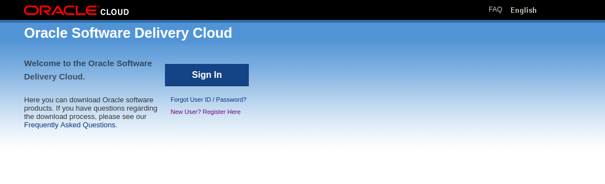
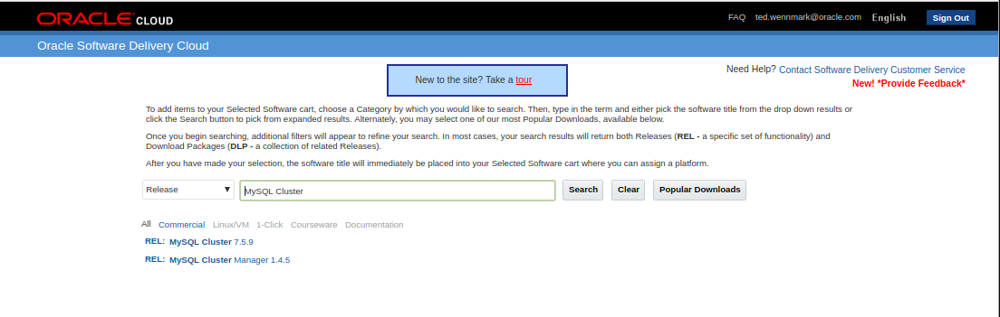
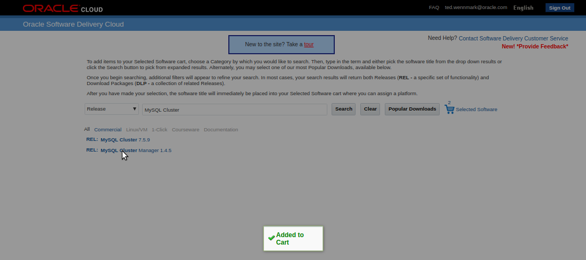
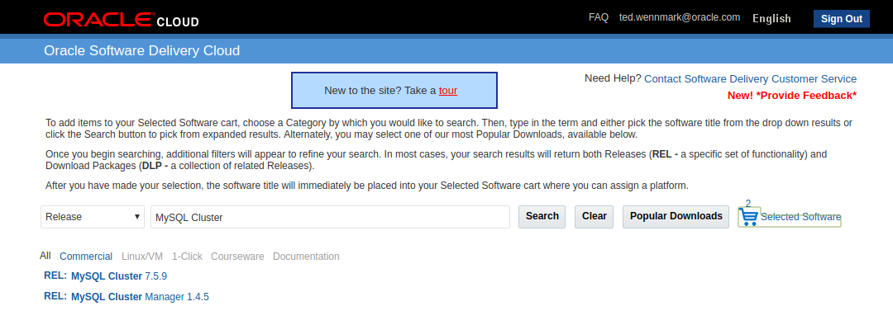

**[Back to Agenda](./../README.md)**

# Download MySQL Cluster Software

1. Navigate to [Oracle Software Delivery Cloud](https://edelivery.oracle.com/osdc/faces/Home.jspx)

Sign in using you Oracle account, if you do not have a Oracle account use option "New User" to create an account.

Pick option "Release" in left dropbox and start printing "MySQL" in second text box, pick "MySQL Cluster" relelase and press search button.

Add the two items:
  - RHEL: MySQL Cluster 7.5.X
  - RHEL: MySQL Cluster Manager 1.4.X

To your shopping basket.

Once done you should see 2 Selected Software in your shopping basket.

